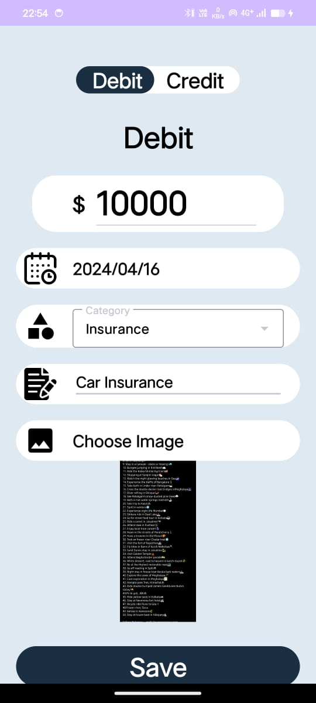

# Expense Tracker Application
Welcome to the Expense Management System repository! This is an Android application designed to help users manage their expenses efficiently.

## About
The Expense Management System is an Android app developed using Kotlin and XML, with Firebase integration for backend services. It allows users to track their expenses, categorize them, and generate insightful reports to help them manage their finances better.

## 🔗 Links
- [Live Demo](https://drive.google.com/drive/folders/1Q4hnqW_l9smCi1t0tuTDoDD_lZxfOnsU?usp=sharing)

## Firebase Setup

This project uses Firebase for various services. To set it up, follow these steps:

1. Go to the Firebase console: [https://console.firebase.google.com/](https://console.firebase.google.com/)
2. Select your project (or create a new one if you don't have one).
3. Navigate to Project Settings.
4. Download the `google-services.json` file.
5. Place the `google-services.json` file in the `app/` directory of your project.

Make sure not to commit this file to version control by adding it to your `.gitignore` file.

## Features
 - User Authentication: Secure login and registration using Firebase Authentication.
- Expense Tracking: Add, edit, and delete expenses with ease.
- Categorization: Organize expenses into various categories.
- Reports: Generate monthly and yearly reports to track spending patterns.
- Real-time Sync: All data is synchronized in real-time with Firebase.
- User-friendly Interface: Simple and intuitive design for seamless user experience.
- Languages: Kotlin, XML
- Technology: Android Studio, Firebase
Screenshots

### Here are some screenshots of the Expense Tracker app:

